### Hi there 👋

<table border="0" frame="void">
  <tr>  
    <td></td>  
    <td></td>  
  </tr>  
  <tr>  
    <td></td>  
    <td> </td>  
  </tr>  
  <tr>  
    <td></td>  
    <td></td>  
  </tr>  

  <tr>  
    <td></td>  
    <td>内容8</td>  
  </tr>  
  <tr>  
    <td colspan="2">这里是合并的单元格内容</td>  
  </tr>
</table>

<!--
**loamen/loamen** is a ✨ _special_ ✨ repository because its `README.md` (this file) appears on your GitHub profile.

Here are some ideas to get you started:

- 🔭 I’m currently working on ...
- 🌱 I’m currently learning ...
- 👯 I’m looking to collaborate on ...
- 🤔 I’m looking for help with ...
- 💬 Ask me about ...
- 📫 How to reach me: ...
- 😄 Pronouns: ...
- ⚡ Fun fact: ...
  -->
